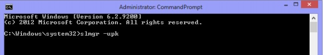
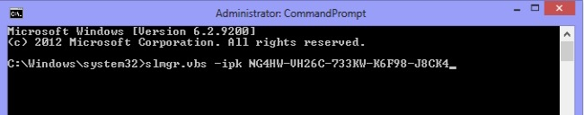
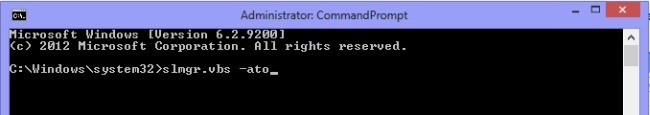

# Product Key

How to change the product key.

Step 1. Go to the search box type "cmd" and start the command prompt as Administrator.

Step 2. In the command prompt type "slmgr -upk" and run it to uninstall the previous key.

Step 3. Now type "slmgr.vbs -ipk <insert your new product key here>" and press Enter. 

A message will be displayed saying that the Product Key was successfully installed.

Step 4. Run "slmgr.vbs -ato"to activate Windows.

You should now have changed the product key.